# Principal - Security Assessment Report

Security assessment of the Hack The Box machine Principal, focusing on JWT/JWE abuse, SSH certificate authentication, and privilege escalation.

## Overview

This report documents a security assessment of the Hack The Box machine Principal. The objective of the assessment was to identify and validate security weaknesses across the exposed services and application components, determine their potential impact, and demonstrate the resulting attack path.

The assessment identified weaknesses in the application's authentication and authorization design, allowing administrative access through a crafted token. Further analysis revealed information disclosure related to SSH certificate-based authentication, which ultimately enabled privilege escalation and full compromise of the target system.

The attack chain progressed from initial reconnaissance and web application analysis to administrative API access, authenticated system access, and root-level compromise.

## Scope

| Item             | Details                                                                            |
| ---------------- | ---------------------------------------------------------------------------------- |
| Target           | Principal                                                                          |
| Platform         | Hack The Box                                                                       |
| Operating System | Linux                                                                              |
| Assessment Type  | Black Box Security Assessment                                                      |
| Objective        | Identify and validate security weaknesses leading to system compromise             |
| Out of Scope     | Denial of Service (DoS), brute-force attacks, and attacks against external systems |

## Methodology

The assessment followed a structured security testing methodology designed to identify, validate, and assess security weaknesses in a controlled environment.

The testing process consisted of the following phases:

1. Reconnaissance and service enumeration
2. Attack surface analysis
3. Authentication and authorization assessment
4. Controlled exploitation
5. Privilege escalation analysis
6. Risk assessment and security recommendations

Each finding was validated through controlled testing and supported by technical evidence collected during the assessment.

## Reconnaissance

Initial reconnaissance identified two exposed services on the target system.

| Port | Service | Version       |
| ---- | ------- | ------------- |
| 22   | SSH     | OpenSSH 9.6p1 |
| 8080 | HTTP    | Jetty         |

The HTTP service on port 8080 redirected users to a login interface identified as Principal Internal Platform. Additionally, HTTP response headers revealed the use of the pac4j-jwt framework, providing an early indication that authentication functionality was likely based on JWT technology.

These findings established the initial attack surface and guided further analysis toward the web application and its authentication mechanisms.

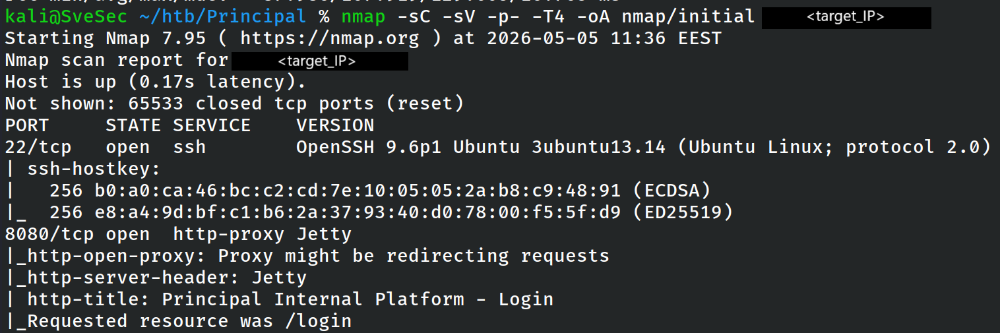

## Attack Surface Analysis

The exposed web application presented a login interface identified as **Principal Internal Platform**. Initial interaction with the application revealed a modern JavaScript-based front-end communicating with multiple backend API endpoints.

Analysis of the login functionality and client-side resources indicated that authentication was handled through token-based mechanisms. Further inspection of the application's JavaScript code exposed several internal API endpoints, including:

* `/api/dashboard`
* `/api/users`
* `/api/settings`
* `/api/auth/jwks`
* `/api/auth/login`

The presence of a publicly accessible JWKS endpoint and references to token validation logic suggested that the application's authentication model relied on JWT/JWE technology. This significantly narrowed the assessment focus toward authentication and authorization mechanisms.

The following evidence illustrates the identified attack surface and the client-side disclosure of authentication-related functionality.

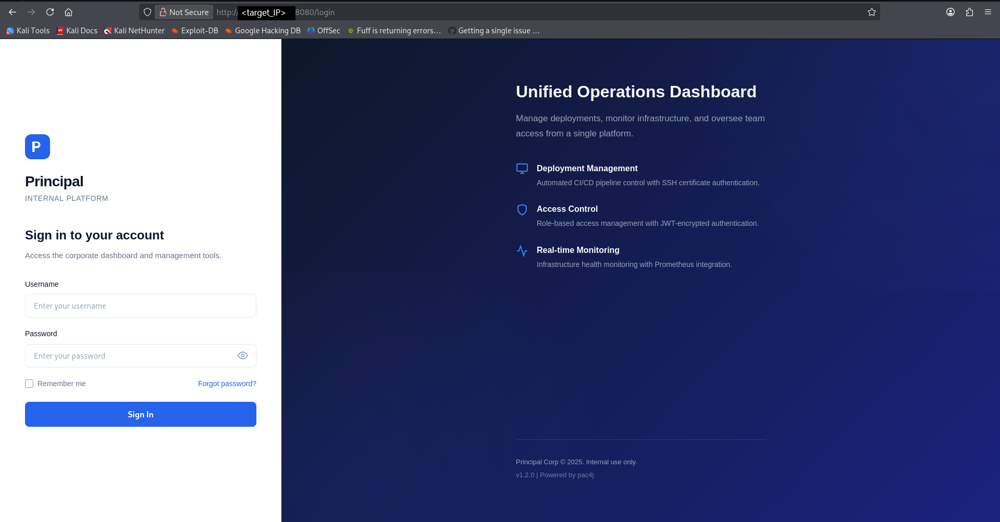

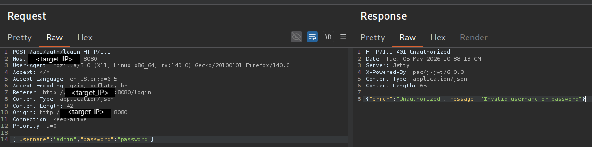

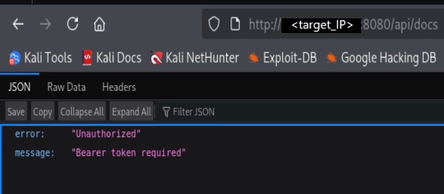

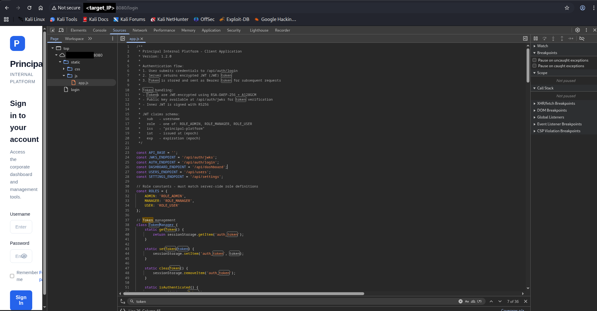

## JWT/JWE Assessment

Analysis of the client-side application revealed references to a publicly accessible JSON Web Key Set (JWKS) endpoint located at `/api/auth/jwks`. The endpoint exposed the public RSA key used by the application for token-related operations.

Further review of the JavaScript authentication logic revealed references to JWT/JWE processing and role-based authorization controls. The application relied on token claims to determine access privileges for administrative functionality.

A custom Python script was developed to interact with the exposed JWKS data and generate a crafted token containing elevated privileges. The resulting token successfully granted access to administrative API functionality.

Successful access to `/api/users` confirmed that the forged token was accepted by the application and that administrative privileges had been obtained.

Additional analysis of `/api/settings` revealed sensitive operational information related to SSH certificate-based authentication, including references to the SSH certificate authority configuration used within the environment. This information ultimately enabled the next phase of the attack.

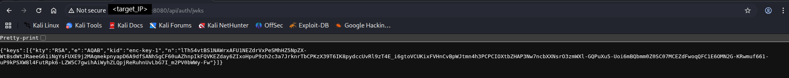

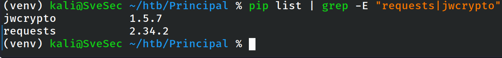

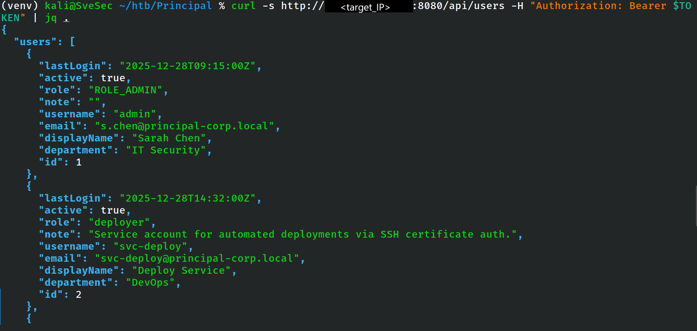

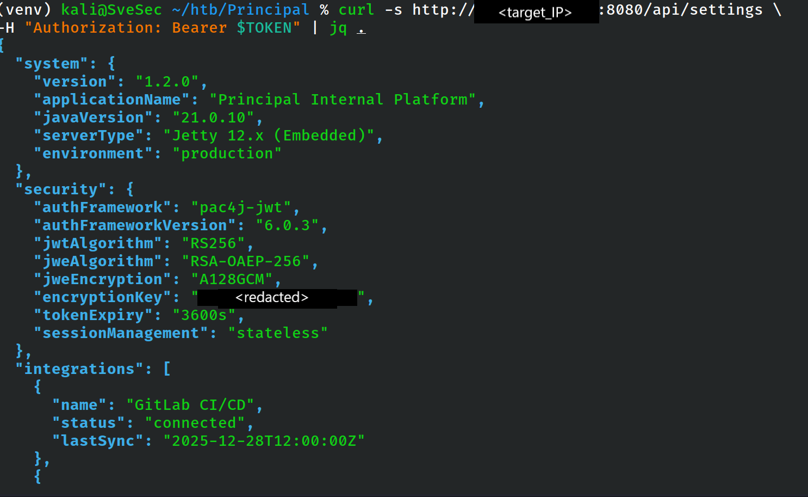

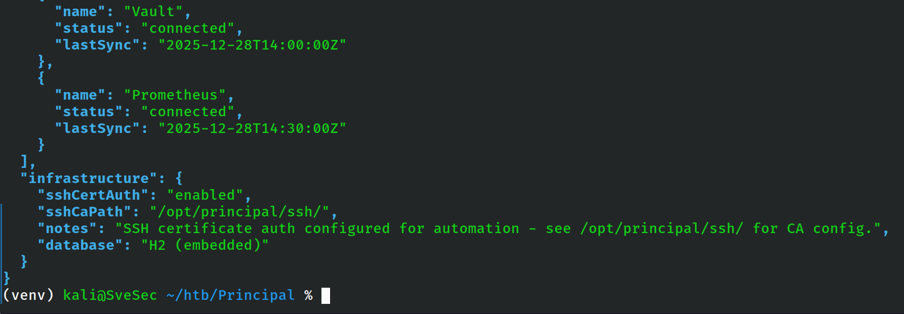

## Initial Access

The administrative access obtained through the forged token exposed sensitive operational information related to the organization's SSH certificate authentication infrastructure.

Review of the disclosed configuration data identified references to a deployment service account (`svc-deploy`) and SSH certificate-based authentication mechanisms used for automation and administrative tasks.

Using the information obtained from the administrative API endpoints, authenticated access to the target system was established as the `svc-deploy` user.

Once access was obtained, system enumeration confirmed the security context of the compromised account and provided visibility into the user's home directory and available resources.

The obtained foothold provided access to additional configuration files and SSH certificate authority information, which became the foundation for the subsequent privilege escalation phase.

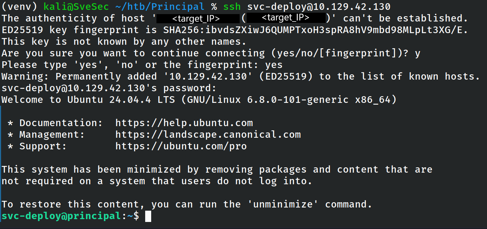

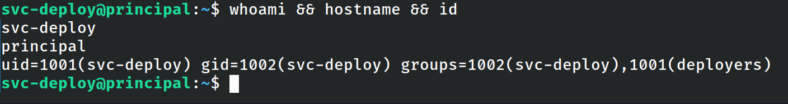

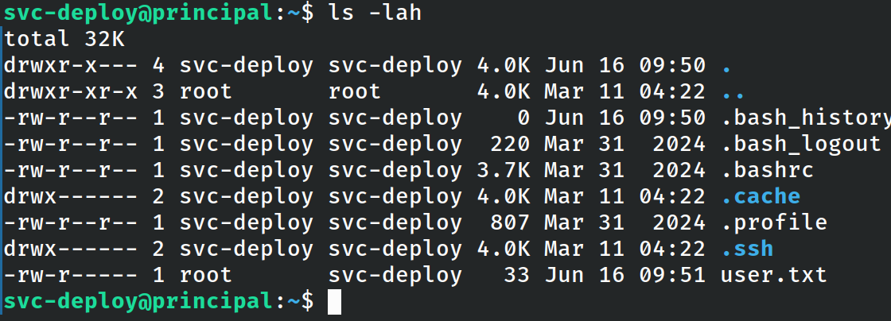

## Privilege Escalation

Following the compromise of the `svc-deploy` account, local enumeration identified multiple files related to SSH certificate-based authentication.

Review of the available documentation and configuration files revealed that the system trusted a dedicated SSH Certificate Authority (CA) for user authentication. Additional investigation confirmed that certificate issuance material was accessible from the compromised context.

The SSH daemon configuration explicitly trusted certificates signed by the configured CA. As a result, possession of the CA signing key enabled the generation of valid certificates for arbitrary user principals.

A new SSH key pair was generated and signed using the trusted CA. The resulting certificate was issued for the `root` principal and successfully accepted by the target system.

This allowed direct SSH authentication as the root user, resulting in full compromise of the host.

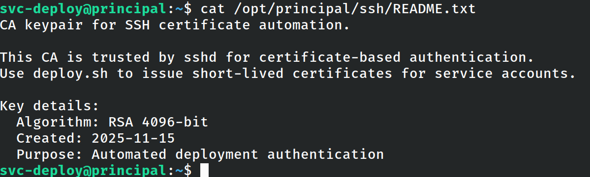

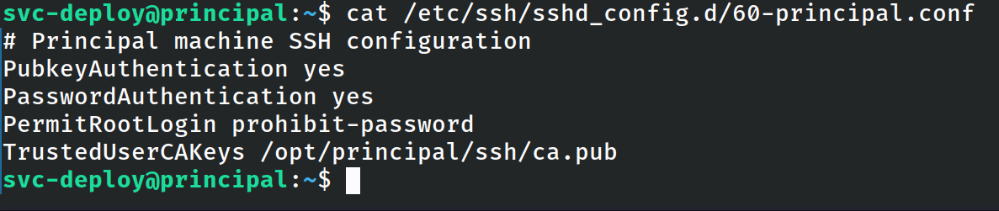

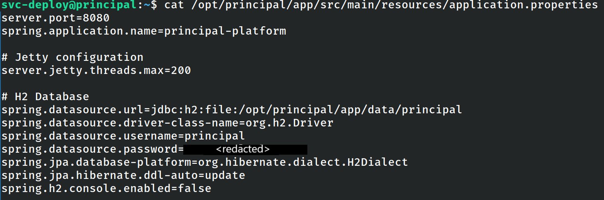

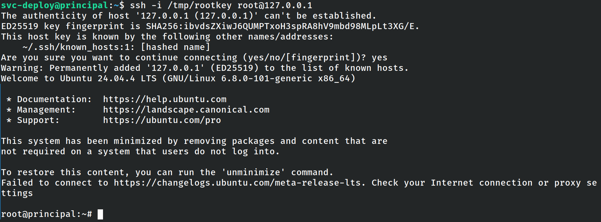

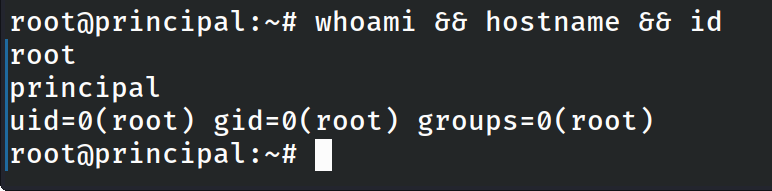

## Findings

### Finding 1 - Improper JWT/JWE Trust Model

**Severity:** High

The application exposed authentication-related functionality through publicly accessible resources and accepted a crafted token containing elevated privileges. Successful token abuse resulted in unauthorized administrative access to protected API endpoints.

**Impact**

An attacker could obtain administrative visibility into sensitive application data and configuration details, significantly increasing the attack surface and enabling further compromise.

### Finding 2 - Sensitive Information Disclosure

**Severity:** High

Administrative API functionality exposed operational information related to SSH certificate authentication, deployment accounts, and certificate authority infrastructure.

**Impact**

Disclosure of security-sensitive configuration information enabled the identification of privileged authentication mechanisms and directly contributed to successful host compromise.

### Finding 3 - Insecure SSH Certificate Authority Exposure

**Severity:** Critical

The compromised account had access to certificate authority material used to establish trust for SSH certificate authentication.

**Impact**

An attacker with access to the affected account could issue valid certificates for arbitrary principals, including root, resulting in complete system compromise.

## Security Recommendations

## Conclusion
